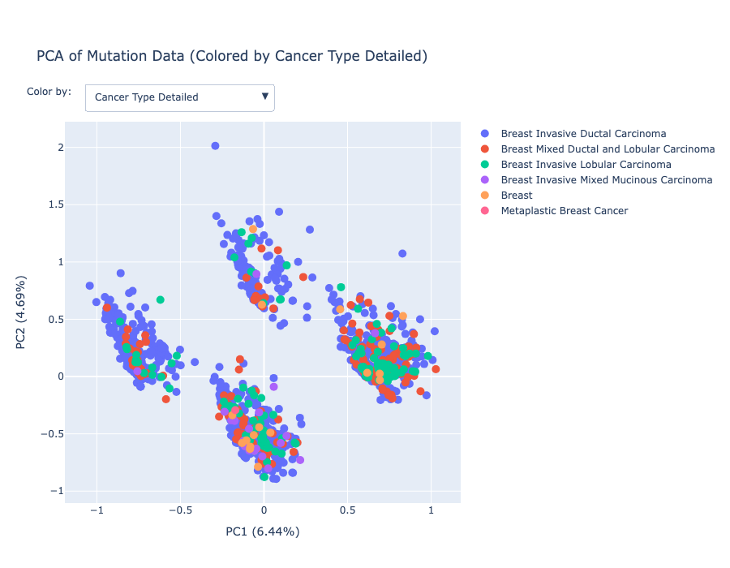

# Breast Cancer Genomic Analysis: Exploring Molecular Patterns with PCA and LDA

Author: Eli Fried

## Motivation

In the Evolutionary Genetics (BIOL-454) course taught by Parul Johri, Ph.D at University of North Carolina at Chapel Hill we read the paper [Genes mirror geography within Europe](https://pubmed.ncbi.nlm.nih.gov/18758442/), (Novembre, J) about how PCA (Principal Component Analysis) was used on human genomes in Europe to map population structure.

I explain more about PCA later in the README, but this method of data analysis allows researchers to simplify high dimensional data by finding axis that explain the highest variance. If you then plot the data based on these axes you are often able to find trends in the data despite the extreme complexity.

Genetic information is perfect for this since it has both high dimensionality (many base-pair sites) and also high homogeneity(genomes are mostly similar). In the paper researchers performed PCA to differentiate the data and plotted the points on a 2D graph where the axes were the first two PCA Components (axes that described the most variance). Shockingly, the plot strongly resembled the geography of Europe and you were even able to pick out significant geographical landmarks such as seas and mountain ranges.

The first two Principal Components corresponded to longitude and latitude with high accuracy and drew my attention to how powerful this method of analysis could be. I decided to try PCA out for myself to gain a better understanding of how it works and its applications.

I decided to work on two projects:

1. **Sage Grouse Genome PCA**

   The first project was using genetic data from the [Gunnison Sage Grouse]() to replicate the results of PCA in the paper [An empirical comparison of population genetic analyses using microsatellite and SNP data for a species of conservation concern](https://doi.org/10.1186/s12864-020-06783-9) by Zimmerman, S.J.

   This project is in another Github repository linked [HERE](https://github.com/elixf7/Sage-Grouse-PCA) if you wish to learn more.

2. **Breast Cancer Genome Analysis**

   The project stored in this repository.

   **Initial Idea:**

   Initially, I wanted to obtain genetic sequencing data from cancer cells and use PCA to find trends in how different subsets of this cancer differ. A factor that can make cancer difficult to treat is the fact that even among similar cancers the mutations that accumulate can be quite different. With PCA analysis I thought I might be better able to visualize the different subgroups of cancer and see if they correlate to other variables such as how aggressive they are, resistance to treatment, etc

   However, human cancer sequences are difficult to obtain (for obvious privacy reasons) and since I did not want to do complex genome transformations and alignment I needed a single study that had already done this with an acceptably large sample size. Due to these restrictions, I decided to use a different type of data for my final project.

   **Final Idea:**

   Since genome information was difficult to obtain and often required complex tools to work with I decided to use the METABRIC dataset described below which focuses on RNA expression data and Mutation data. While this is not ideal, the data is still high dimensional, the sample size is large, and I believed I would still be able to find some trends in the data using PCA.

   I also had the idea to use LDA (Linear Discriminant Analysis) which is similar to PCA in that it is a dimensionality reduction technique, but instead focuses on finding component axes that best separate (classify) a variable. I describe this more in depth later in the README, but using LDA would allow me to see how closely related specific classifications are, and see if the grouping correlate to other variables. For examples of how LDA works go to the LDA section.

## Dataset Overview

This project analyzes the METABRIC (Molecular Taxonomy of Breast Cancer International Consortium) dataset, containing genomic and clinical data from nearly 2,000 primary breast cancer samples. The dataset combines:

- **Clinical data**: Patient demographics, cancer types, treatment approaches, and survival outcomes
- **RNA expression data**: Z-scores for 331 genes representing their expression levels
- **Mutation data**: Binary indicators of mutations across 175 genes
- **Cancer classifications**: Detailed cancer types, histologic subtypes, and molecular clusters

## Exploratory Data Analysis

### Age Distribution and Survival Analysis

The age distribution shows most breast cancer diagnoses occur between 60-70 years. The boxplot reveals survival differences across cancer subtypes. Notably, there's considerable variability in survival time within each cancer type, reflecting the heterogeneous nature of breast cancer.

### Cancer Type Distribution and Treatment Approaches

The pie chart shows Breast Invasive Ductal Carcinoma is the predominant type (79.4%), followed by Breast Mixed Ductal and Lobular Carcinoma (11.0%), Breast Invasive Lobular Carcinoma (7.5%), with other types making up the remainder. The treatment bar graph reveals hormone therapy and radiotherapy are more commonly used than chemotherapy, reflecting standard treatment protocols for hormone receptor-positive breast cancers.

### Mutation Count Distribution

The mutation count histogram shows a right-skewed distribution with most patients having 2-8 mutations, but a long tail extends to 80+ mutations in rare cases. This pattern is typical in cancer genomics and may reflect differences in tumor evolution paths.

## Principal Component Analysis (PCA)

### What is PCA and Its Application in This Project

Principal Component Analysis is a dimensionality reduction technique that transforms high-dimensional data into a new coordinate system where the axes (principal components) represent directions of maximum variance. In this project, PCA helped:

1. Reduce hundreds of gene measurements to a manageable number of components
2. Visualize relationships between samples in 2D space
3. Identify patterns that might distinguish cancer subtypes
4. Compare RNA expression patterns with mutation patterns

### PCA Results for RNA Expression Data

The RNA expression variance plot shows that the first few principal components capture a relatively small percentage of the overall variance. Even with 40 components, we only reach about 53% of cumulative explained variance. This indicates high dimensionality in the RNA data, with information distributed across many components.

This does not capture the amount of variation I would've hope for with that many components. It shows that the data noisy and the variation cannot be explained easily. This is a drawback of having to pivot away from sequence data.

#### Interactive RNA PCA Plot

I plotted the first two principal components on a 2D graph to see if there is any meaningful separation. Together, these components only represent 14.69% of the variation in the data which is quite small. Despite this, you can still see some interesting trends when using the dropdown menu to change how the graph is color coded. Specifically Neoplasm Histologic Grade (how aggressive the cancer is observed to be) shows some significant separation.

By clicking on the image below you are brought to my Github Pages site which has all of my interactive plots. The dropdown allows coloring by different clinical variables, enabling exploration of which factors correlate with genetic expression patterns.

[CLICK ON THE IMAGE OR THIS LINK TO INTERACT WITH PLOTS](https://elixf7.github.io/Breast-Cancer-PCA)

### PCA Results for Mutation Data

The mutation data variance plot shows a more gradual accumulation of explained variance compared to RNA data. With 40 components, we reach about 64% of cumulative variance, indicating slightly better dimensionality reduction potential than RNA data.

#### Interactive Mutation PCA Plot

Despite a slightly higher cumulative explained variance, I am only plotting the first two components which are 6.44% and 4.69% (11.13% total) which is even lower than the RNA plot. As you can see the graph has separated into four subgroups. While at first glance this might appear to be a successful separation, this pattern is likely due to PC1 and PC2 correlating to specific mutations. For example, one group may have both mutations, two of them only have one of the two mutations, and one group has neither mutations. This accounts for the four groups.

While I would like to do more analysis on which mutations these correspond to (likely the most prevalent mutations), this plot does not explain much of the total variance, so the results are not very representative of the entire dataset. Instead, I will use LDA later on to get meaningful insights. Plotting only two of the axes is more of an exercise in understanding PCA rather than generating meaningful visualizations because of the small explained variance.

[CLICK ON THE IMAGE OR THIS LINK TO INTERACT WITH PLOTS](https://elixf7.github.io/Breast-Cancer-PCA)

### Comparing RNA and Mutation PCA Results

The RNA and mutation PCA analyses provide complementary views of breast cancer biology. While they are not as ideal for this task as sequence data since they did not capture as much variation as I hoped, there are still some interesting characteristics that can tell us about the data.

1. **Explained variance**: Both analyses require many components to explain substantial variance, reflecting the complexity of cancer biology, but mutation data appears slightly more reducible.

2. **Clustering patterns**: Mutation data shows more distinct clustering than RNA expression despite the first two components describing less variation than RNA. This is likely due to corelation to specific gene mutations and the 2D plot does not give a good view of the data as a whole.

3. **Biology interpretation**:

   - RNA patterns reflect the functional state of cancer cells (what genes are active)
   - Mutation patterns reveal the underlying genetic alterations driving the disease

4. **Clinical relevance**: The interactive visualizations allow exploration of how molecular patterns relate to clinical variables, potentially revealing biomarkers or treatment targets.

## Linear Discriminant Analysis (LDA)

### What is LDA and How It Complements PCA

Linear Discriminant Analysis is a supervised dimensionality reduction technique that finds linear combinations of features that best separate predefined classes. Unlike PCA (which maximizes variance regardless of class), LDA specifically optimizes for class separation. In this project, LDA:

1. Provides a complementary view to PCA by focusing on features that distinguish cancer types
2. Helps identify genetic signatures associated with specific clinical variables
3. Offers a supervised approach to understanding molecular subtypes

I decided to use LDA since it allowed me to choose a given variable (such as cancer type) and plot it in a way that maximally separates these categories. Then, I can change how the points are colored to see if the distinct groups ALSO correspond to another variable (such as cancer aggressiveness).

You will notice that the LDA plots have more distinct groupings which makes it easier to interpret than my 2D PCA plots.

### LDA Results for RNA Expression Data

[CLICK ON THE IMAGE OR THIS LINK TO INTERACT WITH PLOTS](https://elixf7.github.io/Breast-Cancer-PCA)

The LDA plot for RNA expression data by cancer type shows remarkably good separation between cancer subtypes, especially for Breast Invasive Lobular Carcinoma (green) which forms a distinct cluster. This indicates that gene expression contains strong signals that can differentiate these histological types.

[CLICK ON THE IMAGE OR THIS LINK TO INTERACT WITH PLOTS](https://elixf7.github.io/Breast-Cancer-PCA)

When targeting histologic subtypes, the RNA LDA reveals excellent separation of Lobular carcinomas (green) and Medullary carcinomas (light blue). The clear clustering demonstrates that gene expression profiles strongly correlate with histological features observed under microscope examination.

[CLICK ON THE IMAGE OR THIS LINK TO INTERACT WITH PLOTS](https://elixf7.github.io/Breast-Cancer-PCA)

The integrative cluster LDA shows remarkable separation between molecular subtypes, particularly cluster 10 (light green) and cluster 5 (light blue). The clear boundaries between these clusters validate the molecular taxonomy approach to breast cancer classification and suggest distinct biological mechanisms underlying each subtype.

[CLICK ON THE IMAGE OR THIS LINK TO INTERACT WITH PLOTS](https://elixf7.github.io/Breast-Cancer-PCA)

The LDA by histologic grade shows less distinct separation, with considerable overlap between grades. This suggests that while gene expression can partially predict tumor grade, other factors also influence this pathological assessment.

### LDA Results for Mutation Data

[CLICK ON THE IMAGE OR THIS LINK TO INTERACT WITH PLOTS](https://elixf7.github.io/Breast-Cancer-PCA)

The mutation data LDA for cancer types does not show clear separation of the different cancer types compared to RNA. The only category that has some separation is Breast Invasive Lobular Carcinoma (green), similar to the RNA results. This indicates that mutation profiles may be less adept at distinguishing cancer types compared to gene expression profiles (RNA).

[CLICK ON THE IMAGE OR THIS LINK TO INTERACT WITH PLOTS](https://elixf7.github.io/Breast-Cancer-PCA)

The mutation LDA by histologic subtype shows patterns similar to the RNA analysis, but with some differences in cluster shapes and separations. Lobular carcinomas (green) remain well-separated, indicating consistent molecular signatures across both expression and mutation analyses. However outside green there is not much of a pattern indicating that mutation profiles are not great at distinguishing histological subtypes.

[CLICK ON THE IMAGE OR THIS LINK TO INTERACT WITH PLOTS](https://elixf7.github.io/Breast-Cancer-PCA)

The integrative cluster LDA for mutation data shows less distinct clustering than the RNA analysis, suggesting that the molecular subtypes are defined more by expression patterns than by specific mutations. However, this is still the plot that has the most separation compared to the other three variables examined.

[CLICK ON THE IMAGE OR THIS LINK TO INTERACT WITH PLOTS](https://elixf7.github.io/Breast-Cancer-PCA)

The mutation LDA by grade shows some separation between grade 3 tumors (blue) and others, indicating that higher-grade tumors may have distinctive mutation patterns. Compated to RNA data, there appears to be slightly worse separation by grade using mutation data.

### Comparing RNA and Mutation LDA Results

The LDA analyses reveal important insights about breast cancer molecular classification:

1. **Classification power**: Both RNA and mutation data can separate cancer subtypes, but RNA appears generally more effective, especially for molecular subtypes.

2. **Cancer type distinction**: Lobular carcinoma consistently separates from other types in both analyses, confirming its distinct biological nature.

3. **Histologic correlation**: Gene expression shows stronger correlation with histologic features than mutation data.

4. **Integrative clusters**: These molecular subtypes are better defined by expression patterns than mutation profiles, as shown by the clearer clustering in RNA LDA.

5. **Tumor grade**: RNA expression profiles show better separation by grade than mutation data but they are quite similar, suggesting that certain mutations may drive aggressive behavior.

## Conclusion

This analysis of the METABRIC breast cancer dataset demonstrates the complementary power of unsupervised (PCA) and supervised (LDA) dimensionality reduction techniques in revealing molecular patterns in cancer genomics.

PCA ended up having a low explained variance for even the first 40 principal components, which revealed that the RNA and Mutation data are complex and have a lot of variance explained by multiple variables. The 2D plots did show some separation, but that should be taken with a grain of salt considering they only represented 10-15% of the variation. Despite the PCA results not being incredibly conclusive and satisfying visually, I feel I gained a greater understanding of how dimensionality reduction works, and how it can specifically apply to genetic and biological data.

LDA was more productive in that it was actually able to distinctly separate the categories for each variable quite well. While there was overall more separation for the RNA expression data than the Mutation data, both showed distinct groupings. When changing the color coding of the plots there were definitely some interesting patterns that emerged, which I encourage you to play around with by visiting the links above.

I did not for the most part try to extract findings or clinical insights in this project, but instead wanted to demonstrate the ways in which dimensionality reduction can be used to create interesting visualizations and find patterns in the data that may not be easily found through other methods. I also wanted to assess what types of data work best with these methods and think I succeeded in showing how higher-variance, lower dimensionality data (RNA and Mutation data) differs from sequencing data in that it is harder to creating groupings yet interesting trends still arise.

This project highlights how computational approaches can uncover patterns in complex cancer genomics data that may not be apparent through conventional analyses. The findings could contribute to improved molecular classification, biomarker development, and ultimately personalized treatment approaches for breast cancer patients.

### Next Steps

Going forward, I would love to apply these techniques to sequence data, and break down how different cancer types differ based purely on their raw genetic code. Increasing the level of granularity to base pairs would likely lead to better groupings, and more applicable insights into how different cancer cells can be within a broader designation such as "breast cancer".

When searching for datasets, I played around with the National Cancer Institute [GCD Data Portal](https://portal.gdc.cancer.gov/) which does have standardized sequence data for many different cancer types. It is restricted for obvious reasons, but if researchers with access to this were to perform these analysis techniques I believe it could potentially lead to finding better ways to understand and treat cancer in a way that is extremely specific to the characteristics of the cancer cells in a patient.

## Sources

1. [METABRIC Breast Cancer Dataset - Kaggle](https://www.kaggle.com/datasets/raghadalharbi/breast-cancer-gene-expression-profiles-metabric)

2. Pereira, B., Chin, SF., Rueda, O. et al. The somatic mutation profiles of 2,433 breast cancers refine their genomic and transcriptomic landscapes. Nat Commun 7, 11479 (2016). https://doi.org/10.1038/ncomms11479

3. [Genes mirror geography within Europe (Novembre, J)](https://pubmed.ncbi.nlm.nih.gov/18758442/)

## References for Future Work

1. [GDC Portal](https://portal.gdc.cancer.gov/)

2. [Reddit Thread: cancer datasets](https://www.reddit.com/r/bioinformatics/comments/1bal1ji/what_are_some_cancer_databases_that_yall_use/)
